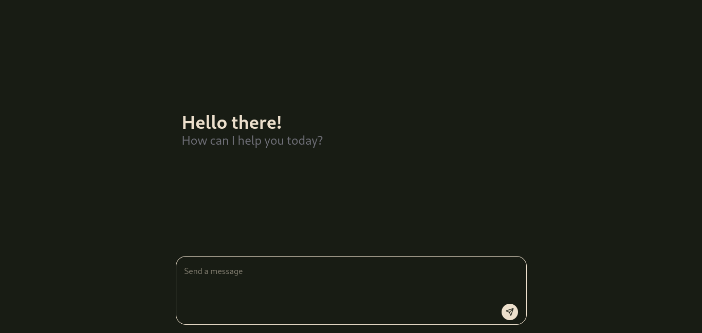
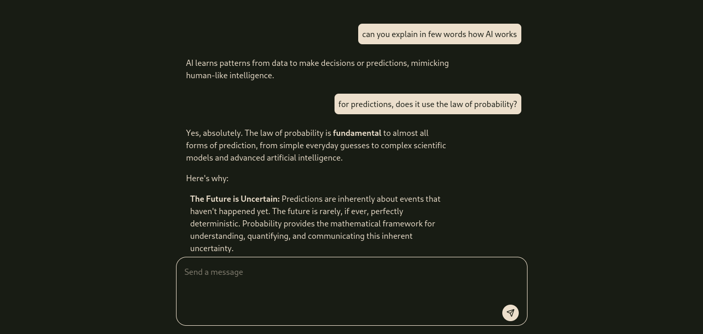

# 🤖 Mini Chatbot

A lightweight AI-powered chatbot built with **Nuxt**, **Vue.js**, and styled using **Tailwind CSS**. This project integrates **Gemini 2.5 Flash** as the conversational AI model to deliver fast and intelligent responses.

## 📌 Project Purpose

This project was created for **practice** and **upskilling**, particularly in:
- Building modern Vue/Nuxt applications
- Working with Tailwind CSS for responsive UI design
- Integrating AI models into frontend projects

## 🛠️ Technologies Used

- **[Nuxt](https://nuxt.com/)** – Server-side rendering & modular architecture
- **[Vue.js](https://vuejs.org/)** – Reactive front-end framework
- **[Tailwind CSS](https://tailwindcss.com/)** – Utility-first CSS framework
- **[Gemini 2.5 Flash](https://deepmind.google/technologies/gemini/)** – Lightweight, fast generative AI model by Google DeepMind

## 🚀 Features

- Real-time conversational interface
- Responsive and clean UI with Tailwind CSS
- Simple and intuitive UX
- Fast and lightweight Gemini 2.5 Flash integration

## 📷 Preview






## 🧠 How It Works

The frontend is powered by Nuxt and Vue.js, where user input is captured and sent to the Gemini 2.5 Flash API (or mock service for development). The response is then rendered in a conversational format.


## 🔐 Environment Variables

Create a `.env` file in the root of your project and add the following:

GOOGLE_API_KEY=your_google_api_key_here


> ⚠️ Keep your API key secure and never expose it publicly.


## 📦 Installation

```bash
# Clone the repository
git clone https://github.com/eubert369/Mini-Chatbot.git
cd Mini-Chatbot

# Install dependencies
npm install

# Run the development server
npm run dev